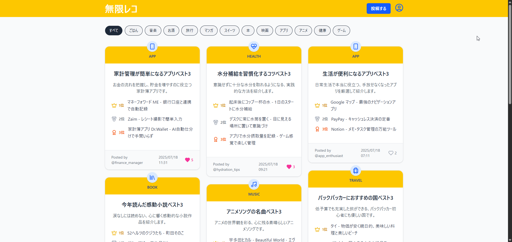
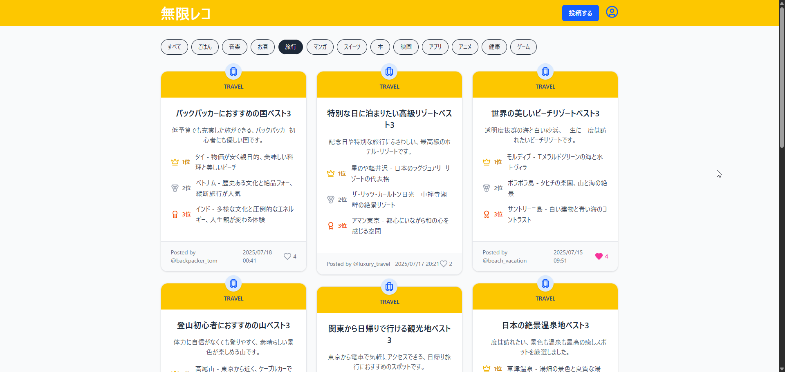
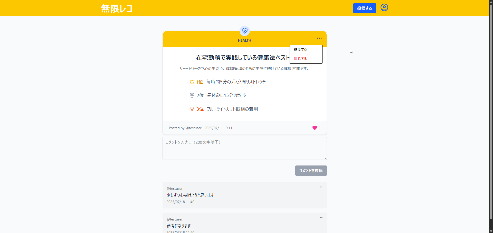
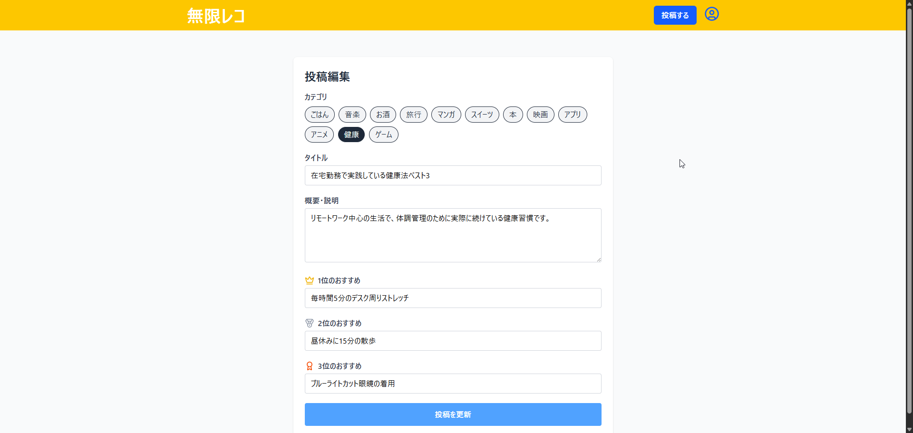
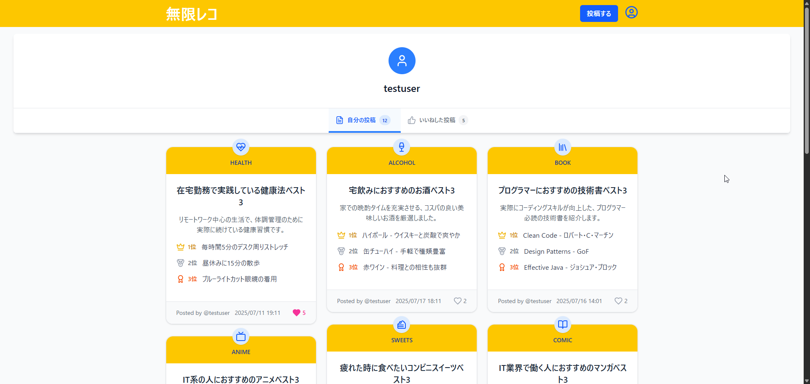
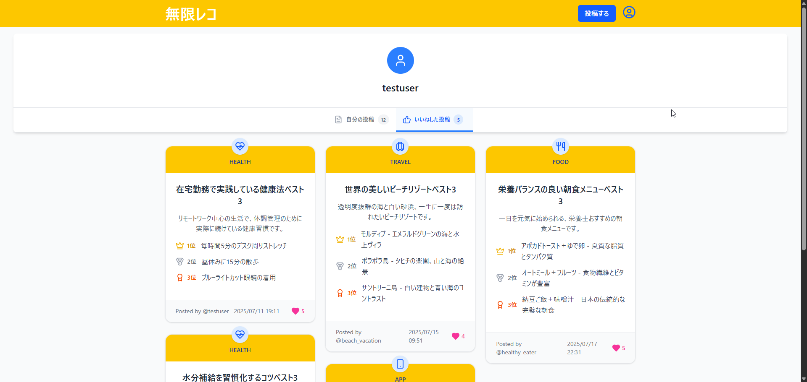
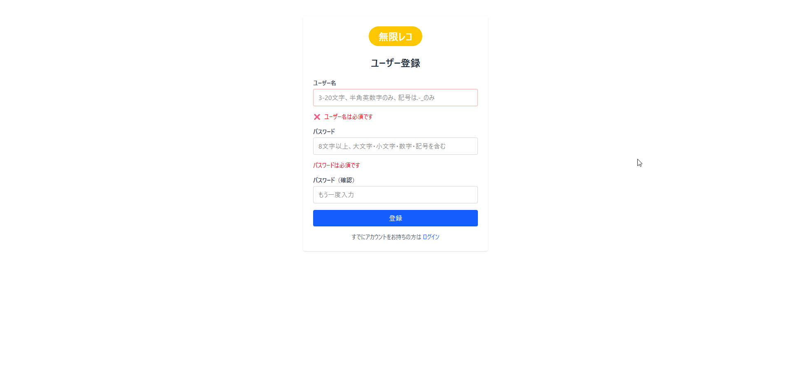
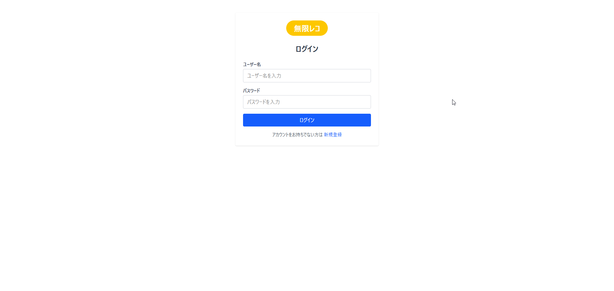

# 無限レコ フロントエンド

おすすめベスト3投稿を共有するSNSアプリ「無限レコ」のフロントエンドです。  
React + Vite + Tailwind CSS を用いて構築されています。

---

## 1. 主な機能

- おすすめ投稿作成・編集・削除
- 投稿一覧表示・カテゴリ別表示（無限スクロール）
- コメント作成・削除
- いいね機能
- ユーザー認証（新規登録・ログイン・ログアウト）
- プロフィール画面

---

## 2. 画面スクリーンショット

### 投稿一覧（無限スクロール）



---

### カテゴリ別投稿一覧（無限スクロール）



---

### 投稿作成画面


---

### 投稿詳細画面




---

### 投稿編集画面



---

### プロフィール画面画面





---

### 新規登録画面



---

### ログイン画面



---


## 3. 使用技術スタック

| 分類 | 技術 |
|------|------|
| フレームワーク | React / Vite |
| スタイリング | Tailwind CSS |
| ルーティング | React Router |
| HTTP通信 | axios |
| グローバル状態管理 | Redux Toolkit |
| サーバー状態管理 | React Query |
| 認証・セキュリティ | Cookie, CSRF対応 |

---

## 4. 📁 ディレクトリ構成（抜粋）

```
src/
├── app/                 # Redux store設定
├── components/          # UIコンポーネント
│   ├── common/         # 共通コンポーネント
│   ├── layout/         # レイアウト関連
│   └── posts/          # 投稿関連コンポーネント
├── hooks/              # カスタムフック
├── pages/              # ページコンポーネント
├── routes/             # ルーティング設定
├── utils/              # ユーティリティ関数
└── constants/          # 定数定義
```

---

## 5. 今後の予定
- テストコードの追加
- ReactのコードのTypeScriptへの移行

## 6. ローカル開発環境のセットアップ手順

### リポジトリをクローン

```bash
git clone https://github.com/waya-kkazuya/mugen-reco-frontend.git
cd mugen-reco-frontend
```

### 依存関係のインストール

```bash
npm install
```

### 環境変数ファイルの作成

```bash
cp .env.example .env.local
```

※.env.localファイルを開いてAPIのURLを入力

### 開発サーバーの起動

```bash
npm run dev
```

## 開発者
- waya
- GitHub: [@waya-kkazuya](https://github.com/waya-kkazuya)
- Xアカウント: https://x.com/waya_dev

